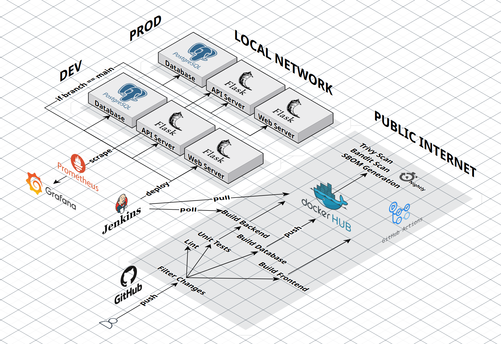

# DevOps Project: URL Shortener

Goal: Develop and deploy an app from scratch using a modern tech stack while touching every part of the product lifecycle.

<!--  -->

## Features

- No "ClickOps". Infrastructure is managed as code with Terraform and Ansible.
- 3-tier application architecture that separates the web interface, REST API, and database.
- Isolated dev and prod environments. Changes are only applied to prod once merged into the main branch.
- "Hybrid" CICD design. Combines modern GitHub Actions workflows with a local Jenkins server specifically for deployments. This design ultimately allows the online workflows to trigger deployments without exposing my intranet.
- On-prem system. Everything is ran on my bare-metal server.
- Local testing simplified with Docker Compose.
- Bread and butter observability with Prometheus and Grafana.
